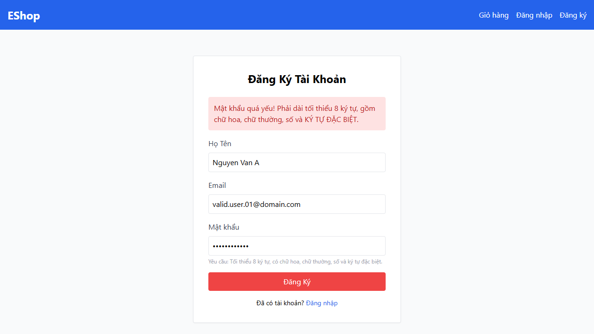
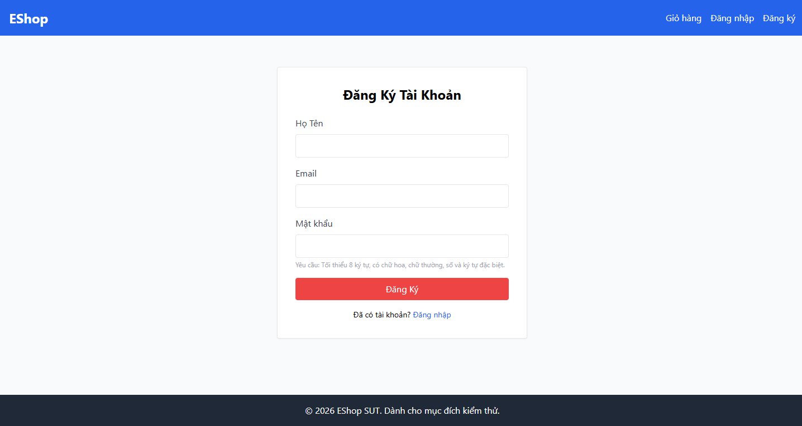
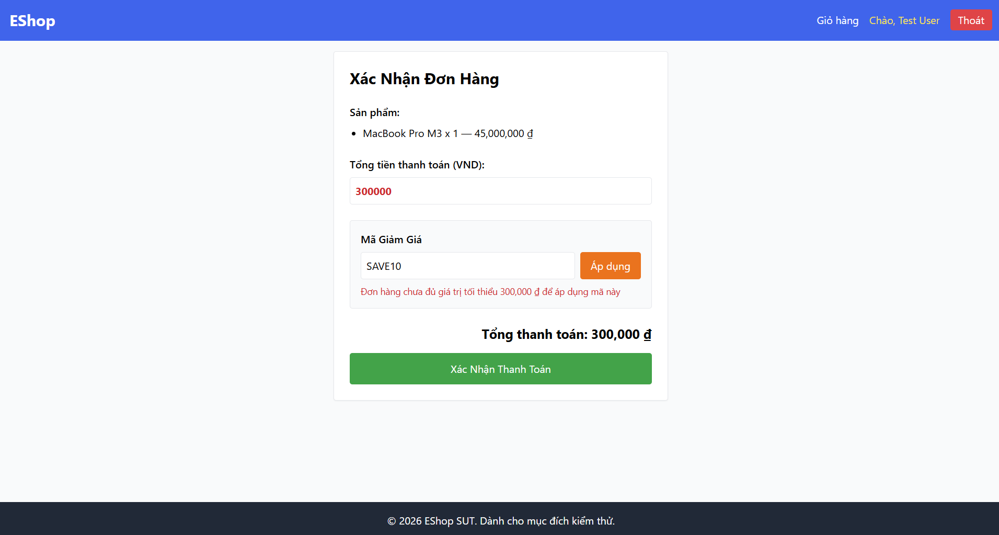
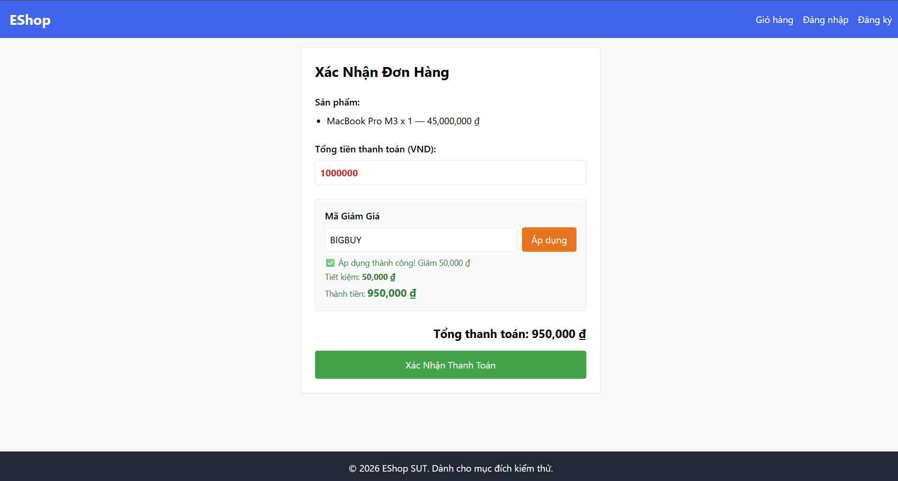
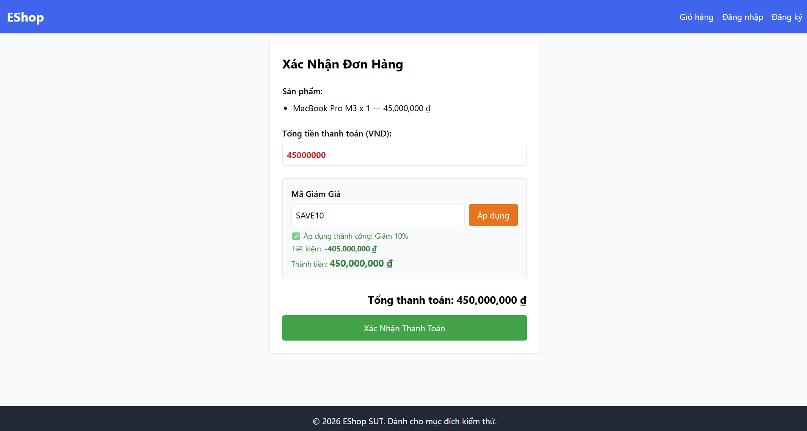

# Bug Report

**Thông tin sinh viên:**

- **Họ và tên:** Trần Thanh Trí
- **MSSV:** 23127503
- **Lớp:** 23KTPM2
- **Môn học:** Kiểm thử phần mềm
- **Hệ thống (SUT):** EShop

---

## Feature A: FR-01: Đăng ký tài khoản (Pool A)

### Bug 1: [Blocker] FR-01: Regex Validation tại Frontend sai logic, từ chối mọi mật khẩu hợp lệ

- **Mức độ (Severity):** Blocker (Nghiêm trọng - Cản trở hoàn toàn luồng người dùng)

- **Mô tả chi tiết:** Theo đặc tả yêu cầu FR-01 và hướng dẫn hiển thị trực tiếp trên giao diện, mật khẩu hợp lệ phải bao gồm: Tối thiểu 8 ký tự, có ít nhất 1 chữ hoa, 1 chữ thường, 1 chữ số và 1 ký tự đặc biệt (VD: `@, $, !, %, *, ?, &`). Tuy nhiên, khi thực hiện kiểm thử trên form Đăng ký và nhập một mật khẩu đáp ứng đầy đủ tất cả các tiêu chí trên (Ví dụ: `Password123!`), hệ thống lại từ chối việc submit form. Màn hình lập tức hiển thị cảnh báo lỗi màu đỏ: _"Mật khẩu quá yếu! Phải dài tối thiểu 8 ký tự, gồm chữ hoa, chữ thường, số và KÝ TỰ ĐẶC BIỆT."_ Qua quá trình điều tra và phân tích hành vi UI (thử nghiệm nhập nhiều biến thể mật khẩu khác nhau, cũng như thay đổi dữ liệu ở các ô nhập liệu khác), hệ thống đều phản hồi bằng duy nhất một thông báo lỗi mật khẩu này. Bất kể dữ liệu đầu vào có hợp lệ hay không, hệ thống vẫn chặn cứng thao tác và không cho phép thực hiện Submit form. Điều này chứng tỏ logic validation trên Frontend đang bị hỏng hoàn toàn (broken validation).

- **Tác động:**
  - Người dùng thực tế hoàn toàn không thể đăng ký được tài khoản mới trên hệ thống dưới bất kỳ hình thức nào.
  - Lỗi validation này chặn đứng quá trình đăng ký ngay từ bước đầu tiên, che khuất (block) việc phát hiện các lỗi validation khác (như nhập trùng email, sai định dạng email, v.v.) và cản trở hoàn toàn việc kiểm thử chức năng tích hợp API.

- **Trạng thái Automation:** Tất cả các Test Cases tự động (bao gồm luồng Happy Path - TC01) đều trả về kết quả `Failed` do bị kẹt tại giao diện báo lỗi này. Để đảm bảo tính minh bạch và trung thực của báo cáo kiểm thử, kịch bản Automation vẫn được giữ nguyên hiện trạng để ghi nhận chính xác sự thất bại của hệ thống SUT mà không sử dụng mẹo lách lỗi (workaround).

- **Issue Link:** https://github.com/Triszz/HW04-Automation_Testing/issues/1

- **Ảnh chụp (Screenshot):**

  

### Bug 2: [UI/UX] FR-01: Màn hình đăng ký thiếu trường nhập "Xác nhận mật khẩu" theo đặc tả yêu cầu

- **Mức độ (Severity):** Major (Cao - Sai lệch so với Đặc tả hệ thống)

- **Mô tả chi tiết:** Dựa trên tài liệu System Requirement của FR-01 (Account Registration): _"Phải có trường Xác nhận mật khẩu — hệ thống từ chối nếu hai trường không khớp."_ Tuy nhiên, trên giao diện thực tế của màn hình Đăng ký (`/register`), form nhập liệu chỉ có 3 trường: "Họ Tên", "Email" và "Mật khẩu". Hoàn toàn không có thẻ `<input>` nào dành cho việc xác nhận mật khẩu.

- **Tác động:**
  - Người dùng không thể xác nhận lại mật khẩu họ vừa nhập (rất dễ dẫn đến việc gõ nhầm mật khẩu mà không biết).
  - Không thể thực hiện kịch bản kiểm tra logic "Mật khẩu không khớp" như yêu cầu của khách hàng/giảng viên.

- **Trạng thái Automation:** Kịch bản Automation đã phải comment (vô hiệu hóa) dòng lệnh `await page.locator('label:has-text("Xác nhận mật khẩu") + input').fill(data.confirmPassword);` vì phần tử này không tồn tại trong DOM (gây lỗi Timeout khi chạy tự động). Test case Negative TC10 (Mật khẩu không khớp) hiện đang bị Block không thể thực thi.

- **Issue Link:** https://github.com/Triszz/HW04-Automation_Testing/issues/2

- **Ảnh chụp (Screenshot):**

  

---

## Feature B: FR-09: Mã Giảm Giá (Coupon) (Pool B)

### Bug 1: [Major] FR-09: Từ chối áp dụng mã giảm giá khi tổng tiền bằng đúng ngưỡng tối thiểu

- **Mức độ (Severity):** Major (Cao - Ảnh hưởng trực tiếp đến quyền lợi thanh toán của người dùng)

- **Mô tả chi tiết:** Theo đặc tả C3 của FR-09, điều kiện để áp dụng mã giảm giá là Tổng đơn hàng `>= (lớn hơn hoặc bằng)` ngưỡng tối thiểu (`min_order_amount`). Tuy nhiên, khi thực hiện kiểm thử giá trị biên với mã `SAVE10` (Ngưỡng 300,000đ), nếu nhập tổng tiền là đúng `300000`, hệ thống từ chối áp dụng mã và văng lỗi _"Đơn hàng chưa đủ giá trị tối thiểu..."_. Nguyên nhân cốt lõi (Root cause) có khả năng do Backend đang sử dụng toán tử lớn hơn `>` thay vì lớn hơn hoặc bằng `>=`.

- **Tác động:** Người dùng mua hàng đạt đúng điều kiện tối thiểu không thể sử dụng mã giảm giá, gây trải nghiệm xấu và có thể làm giảm tỷ lệ chuyển đổi đơn hàng (Conversion rate).

- **Trạng thái Automation:** Test Cases kiểm tra giá trị biên (TC01, TC03) đều trả về `Failed`. Đã chủ động đánh dấu `test.fail()` trong kịch bản để ghi nhận Known Bug.

- **Issue Link:** https://github.com/Triszz/HW04-Automation_Testing/issues/3

- **Ảnh chụp (Screenshot):**

  

### Bug 2: [Major] FR-09: API /apply-coupon bỏ qua kiểm tra JWT Token cho phép Guest xác thực mã giảm giá

- **Mức độ (Severity):** Major (Cao - Lỗi logic luồng người dùng và rò rỉ thông tin mã khuyến mãi)

- **Mô tả chi tiết:** Theo điều kiện C4 của FR-09, người dùng bắt buộc phải đăng nhập (có JWT Token) mới được áp dụng mã. Tuy nhiên, trong kịch bản Automation UI (không thực hiện thao tác Đăng nhập), biến `user_id` bị truyền `null` xuống API. Endpoint `POST /api/apply-coupon` không phản hồi mã lỗi `401 Unauthorized` để chặn từ sớm, mà vẫn chấp nhận tính toán và trả về kết quả thành công (Status 200).
  _(Lưu ý: Mặc dù hệ thống chặn ở bước Thanh toán `/checkout` và không trừ số lượt dùng của mã, nhưng việc bypass được ở bước apply vẫn là một lỗi logic)._

- **Tác động:**
  - **Trải nghiệm người dùng (UX) kém:** Khách hàng vãng lai (Guest) tưởng rằng mình được giảm giá, nhưng đến khi bấm "Xác nhận thanh toán" mới bị chặn lại, gây hụt hẫng và ức chế.
  - **Rủi ro bảo mật (Information Disclosure):** Kẻ gian có thể lợi dụng endpoint `/apply-coupon` không yêu cầu token này để viết script dò tìm (brute-force) toàn bộ các mã giảm giá đang hoạt động trong hệ thống.

- **Trạng thái Automation:** Các Test Cases kiểm tra Auth (TC09, TC10) đều `Failed` (do kỳ vọng báo lỗi nhưng hệ thống lại báo thành công). Đã đánh dấu `test.fail()`.

- **Issue Link:** https://github.com/Triszz/HW04-Automation_Testing/issues/4

- **Ảnh chụp (Screenshot):**

  

### Bug 3: [Critical] FR-09: Sai công thức toán học nghiêm trọng khi tính toán mã giảm giá loại phần trăm (Percent)

- **Mức độ (Severity):** Critical (Nghiêm trọng - Thất thoát dữ liệu tài chính, logic sai hoàn toàn)

- **Mô tả chi tiết:** Theo đặc tả, mã loại percent (Ví dụ: `SAVE10` - 10%) phải được tính theo công thức: `discount_amount = total * discount_value / 100`. Tuy nhiên, qua kiểm thử thủ công với tổng đơn hàng là `45,000,000 đ`, hệ thống lại trả về kết quả sai lệch hoàn toàn:
  - Thành tiền: `450,000,000 đ` (Bị nhân lên gấp 10 lần).
  - Tiết kiệm: `-405,000,000 đ` (Hiển thị số âm).

  Lỗi xảy ra do Backend đang sử dụng sai công thức: tính `Thành tiền = total * discount_value` (quên chia 100), và `Tiết kiệm = total - Thành tiền`.

- **Tác động:** Sai lệch toàn bộ dữ liệu thanh toán. Đơn hàng bị đội giá lên gấp nhiều lần và hiển thị số tiền giảm giá âm, gây hoang mang cho khách hàng và phá vỡ hoàn toàn quy trình Checkout.

- **Trạng thái Automation:** Kịch bản ban đầu do AI sinh ra bị lọt lưới (False Positive) do sử dụng Weak Assertion. Tuy nhiên, sau khi em can thiệp nâng cấp lên **Strong Assertion** (kiểm tra chéo giá trị số học), kịch bản đã tự động bắt được lỗi này. Hiện tại, Test Case (TC02) đã bị `Failed` và được chủ động đánh dấu `test.fail()` trong mã nguồn.

- **Issue Link:** https://github.com/Triszz/HW04-Automation_Testing/issues/5

- **Ảnh chụp (Screenshot):**

  

### Bug 4: [Major] FR-09: Thiếu validation chặn giá trị đầu vào là số âm cho tổng đơn hàng

- **Mức độ (Severity):** Major (Cao - Thiếu sót trong Data Validation)

- **Mô tả chi tiết:** Khi thực hiện kiểm thử giá trị ngoại lệ (Edge Case) bằng cách nhập số tiền tổng đơn hàng là số âm (Ví dụ: `-500,000 đ`), hệ thống thay vì phải chặn ngay lập tức và ném ra lỗi _"Tổng tiền không hợp lệ"_ thì lại tiếp nhận giá trị này. Thay vào đó, hệ thống lại xử lý nó bằng cách lọt vào điều kiện kiểm tra Ngưỡng tối thiểu và trả về câu báo lỗi chung chung: _"Đơn hàng chưa đủ giá trị tối thiểu 300,000 đ..."_.

- **Tác động:** Thiếu sót trong việc làm sạch và kiểm tra dữ liệu đầu vào (Input Validation) ở cả tầng Frontend lẫn Backend. Có thể dẫn đến rủi ro bị kẻ gian lợi dụng thay đổi Payload API để gửi các giá trị âm gây lỗi hoặc thao túng doanh thu hệ thống.

- **Trạng thái Automation:** Test Case Edge (TC11) trả về `Failed` do câu báo lỗi không đúng với kỳ vọng. Đã đánh dấu `test.fail()` trong kịch bản.

- **Issue Link:** https://github.com/Triszz/HW04-Automation_Testing/issues/6

- **Ảnh chụp (Screenshot):**

  
